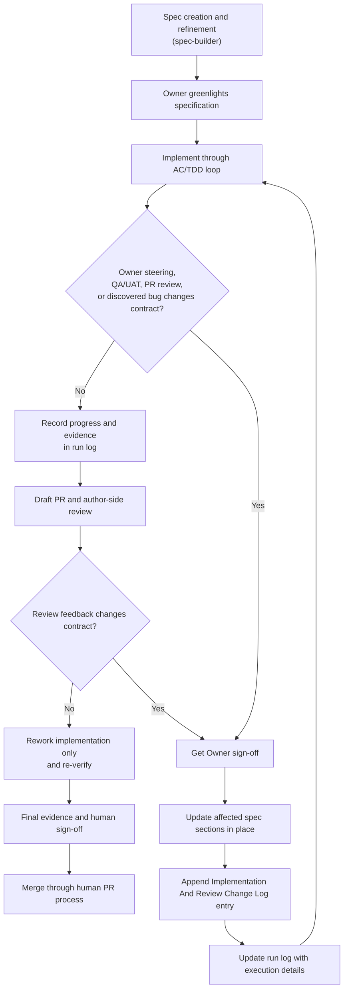

# Spec-Driven Development

Use this skill for the lifecycle around an approved deliverable specification from
greenlight through human-reviewed merge. It does not replace `spec-builder`,
`qa-testing`, `pr-builder`, `pr-review`, `gh-stack`, or implementation agents. It defines
how those roles coordinate around the specification as the current implementation
contract.

If the user is drafting or refining the initial specification before greenlight, use
`spec-builder`. If the user is asking how an approved specification moves through
implementation, steering, QA, PR feedback, controlled contract updates, rework,
re-verification, and sign-off, use this skill.

## Core Model

A deliverable specification is the executable contract for one deliverable. After
greenlight, the body of the specification should continue to read as the current
contract. Accepted Owner steering, QA/UAT findings, PR review feedback, or
implementation-discovered bugs that change the contract update the affected
specification sections in place.

The final `Implementation And Review Change Log` records the audit trail for those
changes. It points to changed sections and explains source, rationale, summary, and
verification impact. It is not a competing list of current requirements.

Append-only execution history still belongs in the run log or repo-declared execution
record. The run log grows as work proceeds; do not rewrite prior entries unless the
user explicitly asks. The run log records attempts, phase progress, failures, evidence,
QA findings, handoffs, and recoveries. The specification records the current contract
plus the final contract-change audit trail.

## Lifecycle



Treat steps as a controlled feedback loop. Implementation, review, and rework may cycle
several times, but every accepted contract change leaves both the current spec body and
the audit trail coherent.

## AC/TDD Implementation Loop

The implementing agent should:

1. read the greenlit specification and required references
2. verify applicable standards from the repo standards index
3. resolve open questions before editing
4. start with the specified TDD entry point or strongest narrow verification
5. implement in small slices against acceptance criteria
6. run the named tests or manual checks
7. record phase progress, evidence, deviations, and recoveries in the run log
8. repeat until each current AC has evidence

If an implementation detail can adapt without changing scope, public behavior, ACs, test
strategy, approved review shape, or invariants, log meaningful deviations in the run log
and continue. If the contract changes, use the change protocol below.

## Lead Agent, Subagents, And Tracking

The implementation prompt should name the coordination model. A lead implementation
agent may work alone or coordinate subagents when the active agent harness supports
delegation and the specification allows it.

The lead implementation agent always owns:

- scope control against the current specification
- task/phase delegation boundaries
- file-conflict serialization inside the active worktree
- integration of subagent output
- evidence quality and AC mapping
- run-log and tracker updates
- final PR-ready output

Subagents may own bounded phases, tasks, branch slices, tests, QA checks, or docs only
when the specification names those boundaries. They should return changed-file
summaries, commands run, evidence, risks, and unresolved questions. If subagents are not
available, the lead implementation agent performs the phases directly and records that
in the run log.

Work runs in a single active worktree or stack lane for the approved review artifact.
The lead implementation agent orders delegated work so overlapping file ownership is
serialized. Do not let subagents overwrite one another's edits. When two tasks may touch
the same file, sequence the tasks and reconcile the diff before continuing.

Prefer fresh-context agents for independent QA and verification passes. A QA agent may
focus on functionality, performance, code hygiene, security, accessibility, standards,
or stack no-drift, depending on the specification. QA agents read the current
specification, run log/tracker record, relevant evidence, and focused code scope; they
do not modify code.

Execution tracking follows the repo's declared system:

- **Zazz Board**: load `zazz-board` and update implementation progress, subagent
  task progress, notes, locks when required, statuses, and evidence links through the
  board.
- **Jira**: load `jira` and use repo-provided or Owner-provided Jira issue context;
  do not assume live Jira access unless the repo declares it.
- **Other tracker**: follow the repo-declared tracker workflow.
- **Local run log only**: keep the run log and PR evidence current.

## Change Protocol

Use this protocol when accepted feedback changes scope, public behavior, UX workflow,
API/schema/validation behavior, bug-fix behavior, test strategy, execution sequence,
approved review shape, branch contract, invariants, or acceptance criteria.

1. Stop coding the affected slice.
2. Identify the sections that need to change.
3. Get Owner sign-off for the contract change.
4. Update the affected specification sections in place so they describe the current
   contract.
5. Append an `Implementation And Review Change Log` entry at the end of the
   specification.
6. Record execution details in the run log, including rework and re-verification notes.
7. Re-run any tests or manual checks whose evidence may have been invalidated.
8. For stacked branches, rebase/propagate the updated lower-branch contract upstack and
   re-run no-drift checks.

Use this entry shape:

```markdown
### YYYY-MM-DD HH:MM TZ — Short Change Title

**Source.** Owner steering, QA/UAT, PR review, implementation-discovered bug, or other source.

**Changed Sections.** Links or section numbers.

**Rationale.** Why the accepted change was needed.

**Summary.** Short summary of the in-place spec edits.

**Verification Impact.** Tests, manual checks, evidence, or re-verification now required.
```

## What Belongs Where

- **Specification body**: current executable contract. Update it in place when accepted
  feedback changes the contract.
- **Implementation And Review Change Log**: final spec section; audit trail for
  accepted contract changes after greenlight.
- **Run log / execution record**: append-only execution history, attempts, phase progress,
  evidence locations, failures, recoveries, QA findings, handoffs, and rework notes.
- **PR body / review thread**: reviewer-facing summary, evidence, open risks, and review
  conversation. Summarize material spec changes and link the specification.
- **Commit history**: implementation history. Do not rely on commits alone to explain
  contract changes.

## Do Not Use The Change Log For

- ordinary progress notes
- test command output with no contract change
- pure refactors that preserve contract
- formatting, naming, or README cleanup unrelated to the deliverable's product contract
- PR-body-only edits
- temporary failed attempts
- implementation details that remain within adaptive guidance

Those belong in the run log, PR, or commit history as appropriate.

## When To Create A New Spec Instead

Create or request a separate specification when accepted feedback:

- creates a new deliverable boundary
- needs a separate review artifact
- changes branch/PR topology beyond the approved review shape
- introduces a new feature context
- makes the original deliverable misleading even after in-place updates and audit log
- is primarily docs, process, tooling, or standards work outside the deliverable's
  product-facing capability

## Review And Sign-Off

Before marking implementation ready for human review:

- every current AC has evidence
- affected spec sections match the implemented behavior
- each contract change has a final change-log entry
- the run log is current through rework and re-verification
- QA or verifier findings are resolved or explicitly carried as known risk
- draft PR evidence links to the specification and summarizes material contract changes

Humans retain scope approval, subjective product/UX sign-off, PR approval, and merge
authority.

## Skill Boundaries

- Use `spec-builder` for initial specification authoring, templates, intake, topology,
  ACs, test strategy, and implementation prompt shape.
- Use this skill for post-greenlight lifecycle, contract-change handling, evidence
  flow, and sign-off discipline.
- Use `qa-testing` for independent verification and evidence quality.
- Use `pr-builder` for draft-first PR packaging.
- Use `pr-review` for standards/spec compliance review.
- Use `gh-stack` for stacked branch command details when the approved review shape is a
  stack.
