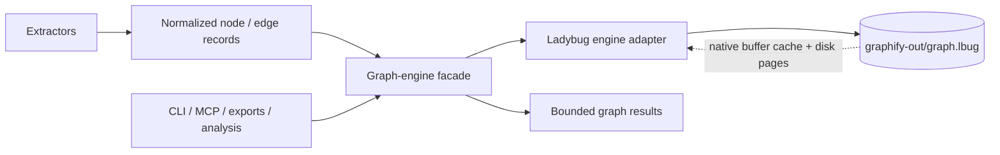
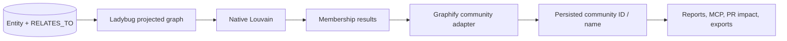
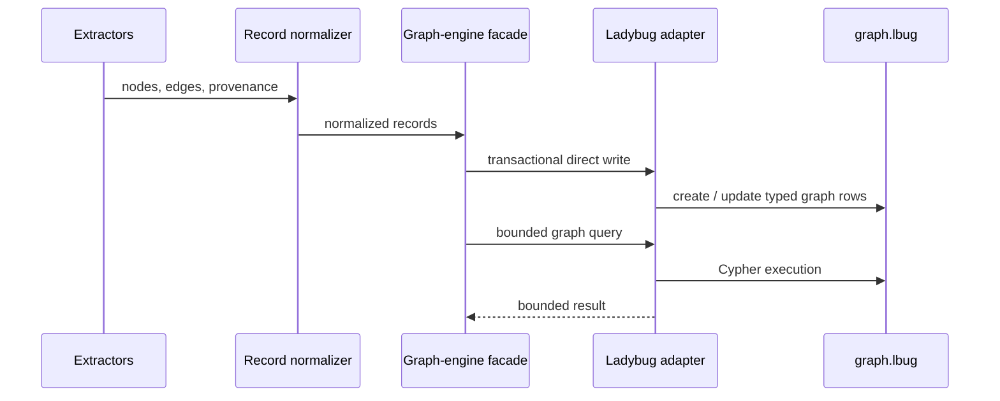
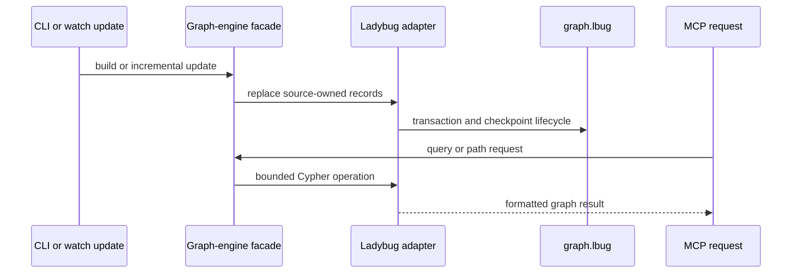

# Architecture: LadybugDB Graph Engine Replacement

**Status:** Discovery — proposed architecture, not implementation approval
**Related feature:** [LadybugDB graph engine replacement](../features/ladybug-db-integration.md)
**Related proposal:** [LadybugDB graph engine replacement](../proposals/ladybug-db-integration.md)

## Scope

This document describes the proposed architecture when a project explicitly selects
LadybugDB as its graph engine. It does not change the upstream baseline architecture
in [ARCHITECTURE.md](../../ARCHITECTURE.md), which remains the NetworkX/JSON design.
The default Zgraphify backend remains NetworkX until the proposal’s evidence gates are
met and a bounded specification is approved.

## Architecture Summary

Ladybug mode is an in-process, on-disk graph-engine replacement. Graphify writes
normalized extraction records directly to `graphify-out/graph.lbug`, then uses
Ladybug/Cypher operations for normal build, incremental update, query, traversal, and
eventually all graph-dependent analysis and outputs. NetworkX is not a permanent
shadow copy of the Ladybug graph.



This target diagram deliberately contains no NetworkX graph. The existing
`graph_engine = "networkx"` backend continues to use the baseline pipeline and is a
separate selectable implementation.

## Runtime and Memory Model

LadybugDB runs inside the Graphify Python process through its Python package. In
Ladybug mode, Graphify opens an on-disk `Database` object for
`graphify-out/graph.lbug` and creates connections from that object. The database file
is durable; the engine’s buffer manager caches recently read disk pages and uses
native working memory for queries. It is therefore memory-resident enough to keep hot
queries fast without requiring a complete Python NetworkX object graph.

Ladybug’s in-memory database mode is not the proposed Graphify runtime: it is
ephemeral and loses the graph when the process exits. The proposed on-disk mode can
process larger-than-memory workloads, uses a write-ahead log for changes, and may use
temporary files under memory pressure. [Ladybug persistence](https://docs.ladybugdb.com/get-started/)
[Ladybug database internals](https://docs.ladybugdb.com/developer-guide/database-internal/)
[Ladybug database files](https://docs.ladybugdb.com/developer-guide/files/)

### Required extension provisioning

Ladybug mode provisions extensions required to match existing Graphify use cases; it
does not leave those capabilities to ad hoc developer setup.

```cypher
INSTALL algo;
LOAD algo;
INSTALL fts;
LOAD fts;
```

| Extension | Engine responsibility | Existing Graphify behavior it supports |
| --- | --- | --- |
| `algo` | Create and execute projected-graph algorithms. | Community clustering and available structural analysis. |
| `fts` | Build and query full-text indexes over selected `Entity` string properties. | Candidate generation for node and natural-language graph queries before bounded Graphify reranking. |

The engine verifies both extensions and their required indexes before serving an
operation. The `algo` extension is required for native clustering; the `fts` extension
is required so text queries do not need a full in-memory trigram index. The core engine
covers bounded traversal and shortest-path operations without an additional extension.
No vector, LLM, cloud, or external-data extension is required unless Zgraphify first
adds a corresponding product capability. [Ladybug extensions](https://docs.ladybugdb.com/extensions/)

| Concern | Ladybug-mode design |
| --- | --- |
| Durable graph | `graphify-out/graph.lbug` is the authoritative graph artifact. |
| Fast queries | A long-lived MCP process retains one `Database` object and its native cache; queries return bounded rows or traversal frontiers. |
| CLI use | A short-lived CLI opens the selected engine for one operation and closes it; it does not load node-link JSON into NetworkX. |
| Build/update memory | Direct, bounded record writes avoid constructing a complete NetworkX graph in normal Ladybug mode. |
| Query memory | Do not materialize full result sets as Python lists, DataFrames, or NetworkX graphs. Measure process RSS, including native allocations. |
| Concurrent access | One read-write `Database` object owns a database file; connections from that object may be concurrent. Separate read/write and read-only objects cannot safely access the same file concurrently. [Ladybug concurrency](https://docs.ladybugdb.com/concurrency/) |

## Engine Boundary and Proposed Module Placement

The boundary is a proposed shape, not a present code layout. It isolates Graphify’s
graph semantics from NetworkX and Ladybug APIs so that the default backend and the
Ladybug engine remain selectable without scattering engine checks through callers.

| Proposed module | Responsibility | Existing area it replaces or adapts |
| --- | --- | --- |
| `graphify/graph_engine.py` | Engine protocol, result types, graph identity contract, and backend selection. | Direct NetworkX coupling across build and query callers. |
| `graphify/engines/networkx.py` | Compatibility implementation for the current JSON/NetworkX path. | Current behavior in `build.py`, `export.py`, and `serve.py`. |
| `graphify/engines/ladybug.py` | Schema lifecycle, direct writes, transactional incremental updates, Cypher queries, and bounded result conversion. | Ladybug-mode replacement for full graph construction and serving. |
| `graphify/engine_config.py` | Project-persistent `graph_engine` selection and clear missing-dependency errors. | New configuration boundary. |
| Existing `cluster.py`, `analyze.py`, `export.py`, and `serve.py` | Consume engine operations rather than a NetworkX graph. | NetworkX-specific calls migrate incrementally to engine adapters or Ladybug-native operations. |

The names above are architecture candidates. A later specification must validate the
smallest coherent module layout against the repository’s current conventions before
implementation begins.

## Data Model Vision

The initial schema hypothesis is intentionally generic so that Graphify preserves its
current identity and provenance rules before specializing queries.

| Ladybug table | Purpose | Required concept fields |
| --- | --- | --- |
| `Entity` node table | Every Graphify node. | `id` primary key, label, type, source file, source location, community metadata. |
| `RELATES_TO` relationship table | Directed Graphify edges. | From/to entity IDs, relation, confidence, confidence score, provenance and directional metadata. |
| `Hyperedge` node table | Graph-level hyperedges that cannot be flattened without losing meaning. | Stable hyperedge ID and metadata, joined to member entities. |

Typed fields should cover properties used in Cypher filters, joins, and ordering.
Less-stable metadata requires a schema decision during the discovery spike; it must
not be silently discarded merely to fit a first table design.

## Community Clustering Architecture

Ladybug’s optional `algo` extension provides Louvain as a Cypher-exposed graph
algorithm, alongside PageRank, connected-components, and k-core operations. The
adapter creates a projected graph from the `Entity` and `RELATES_TO` tables, runs the
algorithm against that projection, then stores the resulting community membership for
the selected graph version. Projected graphs are connection-scoped and are evaluated
from the database on demand rather than materialized as a complete in-memory graph.
[Ladybug algo extension](https://docs.ladybugdb.com/extensions/algo/)



The adapter is required because Graphify's present `cluster.py` behavior is more than
raw Louvain: it prefers Leiden when `graspologic` is available, excludes and later
reattaches hubs, re-splits oversized and low-cohesion communities, assigns stable
community IDs, and derives fallback labels. Ladybug documents Louvain, not the
current Leiden path. The discovery spike must prove whether a Ladybug projection plus
post-processing produces useful and stable enough groupings for Graphify; community
membership need not be byte-for-byte identical to be valid, but user-visible behavior
and output quality need review.

Current community membership is used for more than visualization:

| Consumer | Current use of communities | Ladybug-mode design |
| --- | --- | --- |
| `GRAPH_REPORT.md` and labels | Summaries, named community sections, cohesion, and suggested questions. | Read persisted membership and labels through the engine adapter. |
| MCP and CLI | `get_community`, graph statistics, node context, and surprise/question output. | Query community membership and aggregate counts directly in Ladybug. |
| PR analysis | Maps changed files to communities to estimate blast radius and merge-order conflicts. | Filter `Entity.source_file` and aggregate persisted membership in Ladybug. |
| Exports | JSON, HTML, Obsidian, Canvas, GraphML, wiki, and call-flow grouping. | Fetch only the nodes/edges/community groups required by each export; do not recreate the full graph by default. |
| Incremental watch | Stabilizes community IDs and retains labels where membership is unchanged. | Preserve equivalent membership signatures and label-reuse logic in the engine adapter. |
| Deduplication and reflection | Uses community context to constrain or organize results. | Expose bounded community lookup operations instead of a NetworkX graph. |

The algorithm extension is an optional Ladybug capability. Its installation/loading
policy, version pinning, projected-graph lifecycle, direction handling, and result
determinism are all discovery requirements before clustering can leave NetworkX mode.

## Staged Engine Replacement

These are technical transition boundaries, not milestones, dates, or implementation
commitments. Each stage is a gate toward the same intended Ladybug-mode architecture.

### Direct Engine Proof

The first proof writes a representative graph from normalized records directly to
Ladybug and executes a bounded read or traversal query without creating a complete
NetworkX graph.



### Core Engine Migration

Construction, incremental replacement/pruning, and MCP/CLI query paths use the
Ladybug adapter. A long-lived MCP process shares one read-write `Database` object and
connections; it does not reload the entire graph for every request.



### Complete Engine Replacement

Clustering, analysis, report generation, visualizations, global-graph operations,
and PR analysis move to Ladybug-native queries or bounded engine adapters. A
temporary NetworkX projection is removed once the corresponding capability has parity
and performance evidence.

## Cross-Cutting Concerns

- **Configuration:** A committed project setting selects `graph_engine = "networkx"`
  or `graph_engine = "ladybug"`. Environment variables may be explicit temporary
  overrides for benchmarking, not the routine source of truth.
- **Dependency:** Ladybug is an optional `graphifyy[ladybug]` extra. Selecting Ladybug
  without that extra produces a clear installation error; NetworkX mode remains
  usable.
- **Concurrency:** Watch, CLI, and MCP cannot independently open incompatible
  database objects against one writable file. The implementation must choose a
  single-owner process or a safe publish/reopen protocol before shared operation.
- **Recovery:** The database transaction and checkpoint lifecycle must replace the
  existing JSON atomic-write and shrink-guard protections with equivalent refusal,
  backup, and recovery behavior.
- **Compatibility:** `graph.json` may be generated for legacy consumers during
  migration, but is not authoritative in Ladybug mode. It must not cause a hidden
  NetworkX reload in normal Ladybug operation.
- **Observability:** Record the selected engine, graph counts, operation timing, and
  process RSS in benchmark evidence. Do not report Python heap alone as memory use.

## Open Architecture Questions

- Can Ladybug’s available graph algorithms provide equivalent community detection and
  analysis results, or do those capabilities need custom Cypher/adapter designs?
- Which parts of fuzzy/trigram ranking remain a bounded Python layer, and which can
  become Ladybug query predicates or indexes without changing user-visible results?
- Which ownership model best supports watch updates and long-lived MCP use without
  unsafe concurrent access to `graph.lbug`?
- How should hyperedges and nested metadata be represented while retaining existing
  query and export semantics?
- What representative corpus sizes and workloads establish that the complete engine
  replacement is a memory and performance improvement?

## References

- [Feature document](../features/ladybug-db-integration.md)
- [Proposal](../proposals/ladybug-db-integration.md)
- [Current NetworkX baseline](../../ARCHITECTURE.md)
- [Code structure standard](../standards/code-structure.md)
- [Python testing standard](../standards/python-testing.md)
