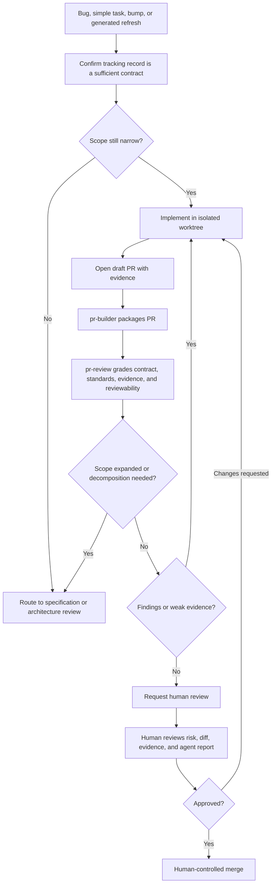
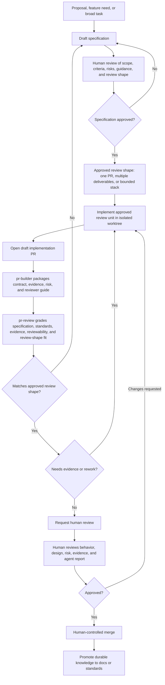

# Human-in-the-Loop PR Review Strategy for AI-Assisted Code

## Executive Summary

AI-assisted development moves the bottleneck from code production to review. An agent can
produce a plausible 100-file pull request faster than a human can understand whether the
change is correct, safe, maintainable, and worth merging.

The recommended Zazz strategy is:

1. Require a documented implementation contract before implementation.
2. Package every PR with evidence and reviewer guidance.
3. Use agents to grade PRs against the implementation contract and repo standards.
4. Verify that broad agent output follows the approved decomposition before human review.
5. Route review depth by change category, blast radius, and risk.
6. Preserve human approval and merge authority.

Humans keep final approval and merge authority. Agents prepare the work, check standards,
surface risk, and reduce manual diff investigation.

Core guardrails:

- No implementation should begin from an ad hoc request alone. The work should start from
  a documented implementation contract: a merged approved specification, approved feature
  or architecture document, detailed bug report, or defined tracker task.
- No human review without a clear implementation contract, evidence, and reviewer
  guidance.
- `pr-builder` packages PR context; `pr-review` grades the PR against the governing
  implementation contract, evidence, and repo standards.
- Bugs and simple tasks can take a fast path when the tracking-system record is a
  sufficient implementation contract.
- New features and broad deliverables require the specification itself to be reviewed,
  approved, merged, and used to define the review shape before implementation starts.
- Broad agent-generated diffs should pass a decomposition gate that verifies the
  implementation followed the approved review shape. If no review shape was approved, the
  work returns to specification update and approval before human review.
- A stack is useful when it creates coherent review units. It is not useful when it turns
  one unreviewable PR into dozens of tiny PRs.
- Humans approve, reject, merge, and own final product risk.

## The Core Problem

Traditional review guidance assumes humans constrain both code production and review.
AI-assisted development changes that balance: generating code is cheap; building justified
confidence is still expensive.

The failure modes are predictable:

- One PR touches too many files, concepts, layers, or owners.
- Generated or mechanical files hide semantic behavior changes.
- Agent-generated tests are numerous but shallow, mock-heavy, or tied to private
  implementation details.
- Reviewers cannot tell whether the PR follows the approved implementation contract.
- Architecture, data, security, migration, or rollback risk is buried inside a broad
  implementation diff.
- Human reviewers become the cleanup crew for poorly shaped automated output.

The strategy is not "make every PR tiny." It is to make every review unit honest: a human
can understand the documented contract, inspect the important diff, trust the evidence,
and make a real approval decision.

AI review is part of the process, not approval authority. With concrete standards,
contracts, and evidence requirements, review agents handle detailed checks while humans
focus on spec alignment, evidence credibility, functional behavior, and merge judgment.

## Review Inputs

Every review needs three inputs.

### Implementation Contract

The implementation contract defines what the PR is expected to do and how the agent
should approach the work.

Use:

- a merged, approved deliverable specification for feature, architecture, refactor, or
  multi-layer work. In normal Zazz workflow, approval means the specification PR was
  reviewed, approved, and merged into the codebase before implementation begins.
- an approved feature or architecture document when the PR implements a slice of a larger
  direction
- a detailed bug report in a tracking system for narrow bugs, when it states the broken
  behavior, expected behavior, reproduction or diagnostic evidence, and pass criteria
- a defined task in a tracking system for simple tasks, when it states the requested
  change, constraints, pass criteria, and validation evidence

The contract can be lightweight, but it cannot be absent. "Build the thing from this
prompt" is not an implementation contract unless the prompt has first been captured as an
approved tracking-system record or specification with enough detail to review against.

If a narrow bug turns into a feature defect, missed feature behavior, incomplete feature
implementation, broad refactor, data model change, architecture change, or cross-service
redesign, stop and route the work through feature, architecture, or deliverable
specification before implementation continues.

For feature and deliverable work, the specification is more than scope. It should usually
include implementation strategy, acceptance criteria, test expectations, and agent
execution guidance. Its milestones, architecture notes, migration steps, rollout plan,
test strategy, execution sequence, and risk boundaries should define the review shape before
work starts:

- small enough for one PR
- too large and should be split into multiple deliverables
- one deliverable that should be implemented as a bounded stack of PRs

For this class of work, decomposition and stacking are specification-time decisions. The
merged approved specification should name each deliverable or stack branch, its purpose,
its acceptance criteria, its evidence expectations, and any ordering assumptions. The
implementation may discover small clarifications, corrected details, or validation notes.
Those can be captured as a specification changelog in the implementation PR when they do
not change scope, acceptance criteria, risk, or review shape. If implementation reveals
	that the approved specification is materially wrong, the correct outcome is to update and
re-approve the specification rather than silently reshaping the work after coding has
started.

### Repo Standards

Repo-specific review policy belongs under `<DOCS_ROOT>/standards/`, indexed by
`<DOCS_ROOT>/standards/index.yaml`.

Standards should be discoverable by path, language, service, domain, or activity:

- `frontend`
- `browser-client`
- `accessibility`
- `api`
- `backend`
- `database`
- `migration`
- `auth`
- `security`
- `integration`
- `generated`
- `testing`

Agent review is only as concrete as the standards it can load. Useful standards name:

- expected implementation patterns
- forbidden shortcuts
- required evidence
- domain-specific edge cases
- examples of acceptable implementation
- examples that require escalation
- generated-file and mechanical-change rules
- test quality expectations

Standards should capture project-specific senior-review expectations:

- which API return codes to use for validation failures, missing resources, auth failures,
  conflicts, rate limits, and unexpected errors
- accepted error response shapes and logging rules
- desired database access patterns, repository boundaries, transaction handling, and
  connection lifecycle rules
- requirements for parameterized SQL queries and prohibited string-concatenated SQL
- migration, backfill, rollback, and compatibility expectations
- browser-client state, accessibility, destructive-action, and loading/error handling
  patterns
- dependency, generated-code, and feature-flag rules
- recommended subject-matter experts, module owners, or designated engineers for areas
  where specialized review is useful

### Evidence

Evidence can include:

- test commands and results
- screenshots or videos
- API or CLI output
- migration checks
- generated-file reproduction commands
- schema or snapshot diffs
- before/after behavior notes
- rollback or monitoring notes
- explicit explanation for missing automated coverage

Evidence should match the risk. A screenshot may support a UI claim; it does not prove API
contract compatibility. A unit test may prove a helper; it does not prove a workflow.

## Operating Model

Implementation PRs should normally open as drafts, run objective checks early, receive an
author-side agent review, and carry clear reviewer guidance before human review.
Advisory labels for risk, evidence, generated artifacts, size, and review shape are useful
inputs, but the source of truth is the approved implementation contract.

A PR that is large, unclear, or missing evidence can be returned to draft or routed back to
specification even if it passes CI.

## Agent-Assisted Review

`pr-review` should normally run before human review and may run again on reviewer
request. It needs:

1. `AGENTS.md` to resolve the docs root and repo workflow.
2. The governing specification, feature document, architecture document, bug report, or
   tracker task.
3. The PR diff.
4. The PR evidence.
5. Relevant standards selected from `<DOCS_ROOT>/standards/index.yaml`.

It produces:

- **Detected facts**: changed files, touched APIs, migrations, generated artifacts,
  tests added, commands run, missing evidence.
- **Contract grading**: whether the PR satisfies the governing implementation contract.
- **Standards grading**: which standards apply and whether the PR follows them.
- **Scope check**: unrelated edits, hidden behavior changes, and whether the diff still
  matches the approved review unit.
- **Test quality assessment**: whether tests prove behavior, use the right layer, and
  avoid mock-only or implementation-confirming assertions.
- **Operational assessment**: deployment, migration, rollback, observability,
  performance, security, and data-handling concerns.
- **Risk and reviewability assessment**: why the facts affect review depth and whether
  the PR can be reviewed as submitted.
- **Recommendation**: keep whole, request evidence, request rework, escalate, request
  specialist review, or return to specification when the approved review shape no longer
  fits.
- **Human attention map**: files, concepts, and decisions that deserve the deepest human
  review.
- **Findings by severity**: critical, important, suggestion, and nit, with facts
  separated from inference.

It should catch repeated senior-review issues before humans spend time on them: wrong API
status codes, inconsistent error shapes, unsafe SQL, missing transaction handling, weak
regression tests, unnecessary abstractions, duplicated local patterns, generated tests
that only confirm the implementation, and hidden data/auth/security/operational risk.

For large or high-risk PRs, graph-assisted context can reduce review archaeology before
the review axes read source files. Zazz treats `code-review-graph` as advisory context for
changed-symbol inventory, blast radius, and read-first ordering; its stock risk and
test-gap signals are not approval criteria. See
[Code Review Graph in Zazz](code-review-graph.md) for current usage guidance and the
planned Zazz-specific fork direction.

The agent may recommend readiness, but it must not approve, mark ready, merge, or
override a human.

## Decomposition Gate

The decomposition gate verifies that the implementation follows the review shape approved
in the specification. For features and deliverables, it should not be the first time the
team decides whether work stays whole, splits into multiple deliverables, or becomes a
stack.

A broad PR should normally remain draft until it has:

- a governing implementation contract
- an approved decomposition, stack, or large-exception review shape when the work is broad
- evidence, an agent review report, and a decomposition rationale linked to the approved
  specification
- a reviewer guide by file group, risk area, or stack branch

Use these signals during specification review and PR review:

- number of concepts a reviewer needs to hold at once
- number of architectural layers touched
- whether foundation work is mixed with consumers
- whether generated or mechanical files obscure semantic changes
- whether security, auth, data, migration, or operational risk is mixed with routine work
- whether each proposed review unit has its own acceptance criteria and evidence
- whether a human reviewer can understand the change without trusting automation blindly

If implementation reveals that the approved review shape is wrong, the correct outcome is
to update and re-approve the merged specification, not an unapproved split, stack, or
large exception.

## Decomposition Strategy

Decompose by review concern, not by file count. For features and deliverables, this
decomposition should be captured and approved in the specification before implementation
starts.

Prefer this order:

1. Separate mechanical from semantic work.
2. Separate foundation from consumers.
3. Separate risk boundaries such as security, auth, migrations, billing, and background
   jobs.
4. Separate refactors from behavior changes.
5. Use vertical slices when they have independent acceptance criteria, evidence, and
   product value.
6. Use horizontal slices when layer risk differs.
7. Cap stack complexity. If honest decomposition creates dozens of PRs, the deliverable
   is too large and should become multiple deliverables.

A broad generated PR may stay whole only when the reviewer can validate it objectively.
Examples:

- deterministic generated artifact refresh
- generated code from an approved source contract
- mechanical codemod with a reproduction command
- formatting-only or lint-only changes
- generated snapshot updates with focused behavior tests

In those cases, review the source contract, generation command, integration impact, and
whether semantic changes are mixed into the mechanical diff.

## Stacked PRs

Stacked PRs are useful when ordered review improves comprehension and merge safety. For
features and deliverables, the stack should be named and approved in the specification
before implementation starts.

The normal case is one deliverable, one worktree, one branch, and one PR. Use a stack
only when one deliverable or dependent deliverable sequence is easier to review as
ordered PRs. In a stack, PR 1 targets the integration branch, PR 2 targets PR 1's branch,
and so on; each PR should show only its own incremental diff.

Use stacked PRs when:

- one deliverable crosses natural layers such as schema, service, API, UI, and rollout
- the single-PR diff would exceed the team's review budget
- the approved specification can name the stack slices before implementation starts
- the work can be split by stable boundaries such as migration, domain model, service
  behavior, API, UI, documentation, or rollout wiring
- foundation decisions need early human feedback
- each branch has a clear purpose, evidence story, and review boundary
- the team has a merge procedure for dependent PRs
- the stack can stay shallow, usually three or four PRs

Avoid stacked PRs when:

- the change is already reviewable as one PR
- the stack would exceed four or five PRs without a clear reason
- each PR only makes sense as "part 1 of a function"
- the stack exists only so the agent can continue coding before the design is settled
- CI or branch protection cannot handle dependent PRs
- the lower branch is volatile enough to invalidate upper branches repeatedly
- the work would be clearer as separate deliverables

Every PR in a stack should receive human sign-off. Stacking reduces context load; it does not
remove the human gate.

### Stacked PR Process

1. The responsible owner approves a specification that says this deliverable will use a
   stack.
2. The specification defines the stack map: slice names, dependency order, acceptance
   criteria covered by each slice, expected reviewers, evidence expectations, and merge
   order.
3. The builder or agent creates one isolated worktree lane for the stack, then creates one
   branch per stack slice using flat branch names that are safe for the Zazz worktree
   layout.
4. The first branch targets the integration branch. Each later branch is based on the
   previous slice's branch.
5. Each branch gets its own draft PR. Every PR body links the specification and includes
   the stack map, parent assumptions, local evidence, and files requiring human attention.
6. `pr-review` runs on each PR and checks whether the slice still matches the overall
   specification and approved stack map.
7. Human reviewers review bottom-up for the full stack, while upper PRs can still receive
   early review before lower PRs merge.
8. Approved slices merge bottom-up. If an early slice changes materially, upper slices
   are restacked and rechecked.
9. When the stack lands, durable knowledge is promoted back into the feature document,
   architecture document, `project.md`, or standards where applicable.

Native worktrees provide local separation. GH-stack or an equivalent tool manages the
dependent branches and PRs inside that isolated lane.

## Review Workflow

### Simple Bugs And Tasks

Use this path for narrow bugs, dependency bumps, generated refreshes, small configuration
changes, and simple tasks where the tracking-system record is a sufficient implementation
contract. A bug report is sufficient only when it states the observed behavior, expected
behavior, reproduction or diagnostic evidence, pass criteria, evidence expectations, and
regression-test expectation clearly enough that implementation does not require product
or architecture judgment. A task is sufficient only when it defines the requested change,
constraints, pass criteria, and validation evidence.

### Features And Deliverables

Use this path when the work changes product behavior, crosses system layers, carries
architecture or data risk, or needs explicit acceptance criteria before implementation.
The key gate is a specification PR that has been reviewed, approved, and merged into the
codebase, not a label. Once merged, the specification defines the implementation
contract, review shape, evidence expectations, and any recommended reviewer expertise.

The review-shape conformance check is not a late opportunity to invent a split or stack. It
confirms that implementation followed the decomposition approved during specification. If
the PR needs a different shape, the specification is updated and re-approved before
human review continues.

## Draft, Ready, And Merge Expectations

### Draft PR

Draft PRs are for shaping and cleanup before human review.

Before requesting review, the author or agent should complete the implementation from the
approved contract, self-review the diff, remove unrelated edits, run practical checks, and
provide test evidence or an explanation for missing evidence.

Expected automation and agent support:

- `pr-builder` creates or refreshes title, body, evidence, risk, and reviewer guide.
- The PR body includes explicit reviewer instructions: what the human should inspect,
  what to test manually, which acceptance criteria are already covered by automated or
  agent validation, and which standards or guidelines were checked.
- If the implementation updates the merged specification with non-material
  clarifications, the PR body includes a short specification changelog that explains what
  changed and why it does not alter scope, acceptance criteria, risk, or review shape.
- Advisory risk labels are added from path ownership, change type, complexity, churn,
  evidence gaps, generated artifacts, and proposed review shape.
- Template validation checks that the implementation contract, evidence, provenance/trust
  notes, reviewer guide, and stack map are present when required.
- Objective checks run early.
- `pr-review` runs as an author-side senior-engineer hygiene pass against the governing
  contract, evidence, and repo standards.
- Missing context, evidence, standards coverage, or approved decomposition rationale is
  flagged.

### Ready For Review

Before requesting human review, the PR should generally have:

- passing required checks or a documented failure reason
- no unresolved critical agent findings
- complete evidence and reviewer guidance
- completed specification changelog when the implementation PR includes non-material spec
  updates
- checklist-style human verification instructions in the PR body
- recommended review tier and rationale
- stack map and parent assumptions when the approved specification uses a stack
- decomposition rationale for broad diffs, tied back to the approved specification

### Before Merge

Before merge, the PR should have:

- required human approvals for its tier
- no unresolved critical or important review comments
- up-to-date base, merge queue, or equivalent validation
- rollback or monitoring notes when operational risk exists

## Review Tiers

### Automated Tier

Low-risk changes where checks and agent review can do most verification before a lighter
human review.

Examples:

- docs-only edits
- deterministic generated-file refreshes
- formatting-only changes
- dependency patch bumps within an approved policy
- mechanical changes with strong test evidence

This tier does not mean auto-merge or unattended approval.

### Standard Tier

Normal application or service logic changes.

Requirements:

- passing checks
- `pr-review` first pass
- evidence section complete
- one human approval

Recommended when useful:

- designated engineer or module owner review for areas with specialized context, recent
  churn, unclear ownership, or non-obvious local patterns

### Critical Tier

Changes where failure can cause production incidents, data loss, security exposure,
broken external contracts, or broad downstream rework.

Requirements:

- named owner or CODEOWNER approval
- `pr-review` first pass
- stronger evidence and regression coverage
- additional reviewer or domain lead when blast radius is high

Critical-tier routing should prefer the most relevant subject-matter expert when one is
known. That reviewer may be a CODEOWNER, module owner, service owner, feature owner, or
engineer with deep context in the affected functionality.

### Large Exception

A PR that exceeds the normal review budget but cannot reasonably be split.

Requirements:

- explicit explanation for why it cannot be split
- reviewer consent before expecting full review
- review map by file group or concept
- files requiring deepest human attention
- stronger tests and runtime evidence

Large exceptions should be rare. "The agent already wrote it this way" is not a valid
reason.

## Risk Signals

Assign risk from a combination of:

- **Path category**: auth, migrations, public APIs, infrastructure, shared packages, or
  other sensitive areas.
- **Change type**: behavior, contract, data shape, permissions, deployment wiring,
  retries, error handling, rollback paths, or feature flags.
- **Blast radius**: affected services, browser clients, jobs, external consumers, or user
  workflows.
- **Complexity**: state transitions, async races, cross-service side effects, or logic
  that is hard to test.
- **Churn and fragility**: recent changes, known bug history, flaky tests, brittle mocks,
  or unclear ownership.
- **Observability and rollback**: whether failures are easy to detect, isolate, and roll
  back.
- **Evidence quality**: whether tests and runtime evidence match the introduced risk.

Cyclomatic complexity is useful as a review-depth signal. A small PR that changes a
high-complexity decision function can deserve more scrutiny than a larger mechanical PR.
The same applies to changes with many branches, permissions, retries, asynchronous
states, or cross-service side effects.

Automation can add advisory labels such as `risk/critical-path`,
`risk/high-complexity`, `risk/high-churn`, `risk/public-contract`, `risk/migration`,
`shape/large-exception`, `shape/stack`, `evidence/missing`, or
`generated/mechanical`. Agents, linters, static analysis, ownership rules, or CI checks
can apply these labels to route review and tell human reviewers what deserves attention:
where the risk is, what evidence is missing, which files may be mechanical, and whether
the PR needs a particular review shape. These labels inform human judgment; they are not
merge authority.

Default critical-path categories:

- authentication and authorization
- sensitive data and privacy
- external contracts such as APIs, schemas, SDKs, and webhooks
- persistence, migrations, data backfills, and transaction behavior
- infrastructure, deployment, runtime configuration, and feature flags
- shared libraries and platform packages
- money, compliance, audit, or customer commitments
- browser-client critical paths such as auth, checkout, destructive actions, offline
  behavior, telemetry, privacy, and accessibility-critical flows
- service critical paths such as queues, retries, idempotency, rate limits, timeouts,
  circuit breakers, and failure handling

Each repo should map these categories to concrete standards, CODEOWNERS, and labels.

That mapping is only the starting point. A reviewer or responsible owner should be able
to raise or lower the tier when the actual change has lower or higher risk than the default,
and the override should be visible so the team can tune the heuristics.

## Testing And Regression Policy

Testing prevents agent-generated code from becoming review theater. A PR should prove
that the implementation contract is satisfied.

Agent-generated tests often fail by being too busy rather than too sparse: many cases,
low signal, and conditions that do not map to real requirements or risk. Review should
reward tests that prove behavior, not tests that merely increase count or coverage.

For bug fixes:

- include a regression test that would have failed before the fix and passes after it
- if automated regression coverage is not practical, explain why and provide stronger
  manual or runtime evidence
- treat "fixed without regression coverage" as an exception

Test strategy should prefer meaningful coverage over test volume:

- choose the lowest layer that proves the behavior
- add higher-level tests when the bug crosses boundaries
- cover realistic field edge cases
- avoid irrelevant permutations that do not represent a requirement, defect, boundary, or
  realistic failure mode
- assert observable behavior or stable contracts rather than private mechanics
- avoid mock-only tests that merely confirm collaborators were called
- reuse existing fixtures and stronger nearby tests when they already prove the behavior

For API defects, prefer automated API-level regression tests over manual request
screenshots. Manual API tools can provide evidence, but future regression prevention
requires an automated check when practical.

For bugs and simple tasks, the tracking-system record should include:

- observed behavior
- expected behavior
- reproduction steps or diagnostic evidence
- acceptance criteria
- test layer and command
- realistic edge cases to cover
- validation evidence required in the PR
- rollback or mitigation notes when operational risk exists
- documented exception and approver if no automated regression test is added

## Provenance And Trust Notes

If AI-assisted development is the default, requiring "AI-assisted" disclosure on every PR
adds noise. The review process should assume agents may have produced, modified,
reviewed, or tested the change.

Instead, disclose information that changes review depth, evidence expectations, or trust
boundaries:

- implementation source: approved specification, detailed bug report, defined tracker
  task, or ad hoc prompt
- whether the author reviewed the final diff and accepts responsibility
- copied external snippets or generated code from outside the repo
- agent-generated tests and whether their assertions were reviewed
- autonomous run versus guided session versus manual follow-up edit
- uncertain assumptions, generated migrations, generated schemas, generated clients, or
  model-inferred behavior

Review should be based on risk, evidence, and ownership, not on whether a human or agent
typed the first draft.

An ad hoc prompt is provenance, not authority. If a PR began from a prompt, the prompt
must be reconciled back to an approved specification, detailed bug report, or defined
tracker task before human review.

## Human Reviewer Expectations

Human reviewers should focus on:

- Is this the right change for the problem?
- Does it preserve system contracts?
- Does it follow repo standards?
- Does it fit local architecture and ownership boundaries?
- Does this PR need a subject-matter expert or designated engineer because it touches a
  specialized module, ownerless area, critical workflow, or recently fragile code?
- Do the tests prove the right behavior, or do they merely pass?
- Are edge cases realistic and tied to requirements, defects, or risk?
- Are failure modes and rollback clear?
- Are there security, data, privacy, or operational risks?
- Is the PR reviewable as submitted?
- Does the agent review report separate facts from risk inference?
- Does the risk tier recommendation make sense?

Humans should not spend review time on:

- formatting
- import ordering
- trivial lint issues
- generated output consistency when deterministic checks can verify it
- template omissions that automation can catch
- reconstructing an agent session from an unclear diff

## Metrics

Track only measures that help tune the process:

- **Workflow type**: guided agent session, autonomous agent run, manual follow-up edit,
  or mixed.
- **Review wait time**: how long PRs sit after review is requested.
- **Review completion time**: how long PRs take from review request to merge or close.
- **Review rounds**: how often PRs need another human pass before approval.
- **Draft cleanup value**: how many meaningful `pr-review` findings are fixed before
  human review starts.
- **Large PR handling**: how often broad PRs follow the approved review shape, are
  approved as large exceptions, or require specification update and re-approval.
- **Evidence readiness**: how often PRs reach review with clear tests, screenshots,
  commands, or documented evidence gaps.
- **Bug-fix protection**: how often bug fixes include a regression test or documented
  exception.
- **Escalations**: how often the proposed review tier changes after agent or human
  review.
- **Risk-tier overrides**: how often humans raise or lower the agent-recommended tier,
  and why.
- **Post-merge problems**: defects, incidents, or reverts connected to reviewed PRs.
- **Agent review quality**: recurring false positives, missed risks, or standards gaps
  found in `pr-review` output.

Do not start with hard service-level targets. First collect enough examples to see where
review actually slows down, where agents help, and where the standards need improvement.

The goal is not reporting for its own sake. The goal is fewer overloaded reviews, fewer
risky rubber-stamps, and better signal for where human attention is needed.

## Rollout Plan

1. **Baseline specification and PR shape**: update spec and PR templates, add advisory
   labels, define initial critical paths, and start measuring review flow.
2. **Standards and agent review**: create or improve `<DOCS_ROOT>/standards/index.yaml`,
   add author-side `pr-review`, and track false positives and missed risks.
3. **Decomposition gate**: require approved review shape and decomposition rationale,
   then pilot specification update and re-approval when PRs drift from the approved review shape.
4. **Risk-tiered routing**: route automated, standard, critical, and large-exception PRs
   differently and define minimum human review expectations for each.
5. **Stack pilot**: use GH-stack and isolated worktree lanes when the approved
   specification calls for a stack.
6. **Continuous calibration**: sample outcomes, tune standards and critical-path
   definitions, and set first-response targets only after observing pilot data.

## Open Decisions

- Which repo-specific paths map to critical-path categories?
- Which complexity and churn signals are practical to collect automatically?
- Which provenance and trust notes should be required?
- What is the minimum human review expectation for automated-tier PRs after checks and
  `pr-review` pass?
- What is the normal maximum stack size before a deliverable should be split?
- Which advisory labels should be automated first: risk, evidence, generated artifacts,
  review shape, size, churn, or complexity?
- Which stack merge procedure should be the default when a lower branch changes after
  upper PRs have already received review?
- After piloting the process, what first-response targets are realistic for standard and
  critical PRs?

## Reference Patterns

These references are included because they directly support the enterprise review model:
contract-first implementation, automated pre-review, human approval, clear reviewer
context, and stacked PR operations.

- Warp agent and contribution workflows: specification, automated review, human approval,
  issue/category routing, and interactive review of agent-generated diffs.
- GitHub, Google, and Microsoft review guidance: small focused changes, clear reviewer
  context, test evidence, and fast but careful review loops.
- OpenHands and Trunk: automated pre-review, PR annotations, and objective code-quality
  checks before humans review.
- GH-stack: dependent PR workflows for reviewable implementation slices.

Sources:

- Warp interactive code review docs: https://docs.warp.dev/agent-platform/local-agents/interactive-code-review
- Warp GitHub Actions agent docs: https://docs.warp.dev/agent-platform/cloud-agents/integrations/github-actions
- Warp contributing guide: https://github.com/warpdotdev/warp/blob/master/CONTRIBUTING.md
- OpenHands PR review docs: https://docs.openhands.dev/sdk/guides/github-workflows/pr-review
- GitHub guide to reviewing AI-generated code: https://docs.github.com/en/copilot/tutorials/review-ai-generated-code
- Google small CL guidance: https://google.github.io/eng-practices/review/developer/small-cls.html
- Google review speed guidance: https://google.github.io/eng-practices/review/reviewer/speed.html
- GitHub guidance on helping reviewers: https://github.com/github/docs/blob/main/content/pull-requests/collaborating-with-pull-requests/getting-started/helping-others-review-your-changes.md
- Microsoft pull request guidance: https://github.com/microsoft/code-with-engineering-playbook/blob/main/docs/code-reviews/pull-requests.md
- GitHub `gh stack`: https://github.com/github/gh-stack
- GitHub `gh stack` overview: https://github.github.com/gh-stack/introduction/overview/
- Trunk GitHub Action: https://github.com/trunk-io/trunk-action
