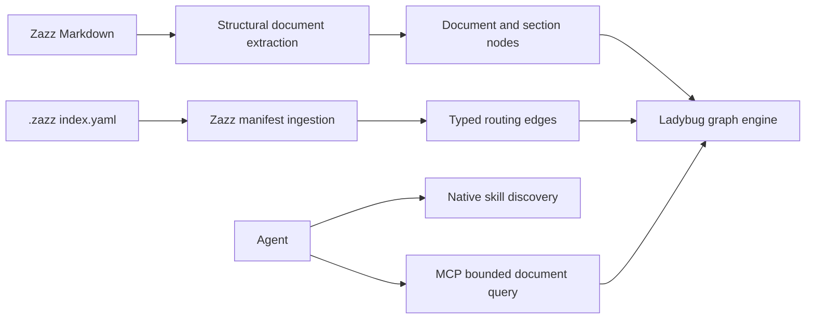
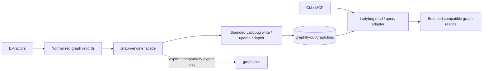
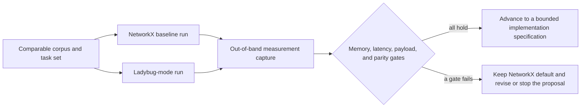

# Proposal: LadybugDB Graph Engine Replacement

**Status:** Discovery — no implementation decision approved
**Scope:** Technical-direction proposal and feature discovery
**Related feature:** [LadybugDB graph engine replacement](../features/ladybug-db-integration.md)

## Context and Problem Statement

Graphify currently builds an in-memory NetworkX graph and serializes it as
`graphify-out/graph.json`. That JSON file is not a passive export: it is the
incremental-build baseline and the input for querying, serving, visualizations,
global-graph merging, PR analysis, and work-memory overlays. The pipeline and
current data shape are described in [ARCHITECTURE.md](../../ARCHITECTURE.md).

JSON makes the graph portable and inspectable, but it requires full-file loading and
NetworkX rehydration for graph operations. It also makes updates, query planning,
indexes, and transactional durability application-level responsibilities.

This proposal investigates whether [LadybugDB](https://github.com/LadybugDB/ladybug)
should become the graph engine for a Ladybug-selected fork-owned Graphify project.
LadybugDB is an embedded, on-disk property-graph database with Cypher, columnar
disk storage, adjacency indexes, ACID transactions, and a Python API. Its Python API
opens an on-disk database through `ladybug.Database(path)` and
`ladybug.Connection`; it also supports in-memory use. [Ladybug Python API](https://docs.ladybugdb.com/client-apis/python/)

## Scope

This proposal evaluates replacing Graphify's NetworkX graph engine with LadybugDB for
an opt-in backend. It includes graph construction, incremental updates, persistence,
querying, clustering and analysis boundaries, migration safety, compatibility, and
operational safety.

It does not approve a dependency, define a deliverable specification, change the
Graphify public CLI, or decide a product release plan. NetworkX remains the engine for
the default JSON backend unless and until a Ladybug mode is approved.

### Initial corpus and test emphasis

The first discovery corpus and performance test cases focus on source code and
Markdown. This matches the fork’s expected use: code supplies the principal structural
graph, while Markdown supplies durable architecture, proposal, and operational context.
Graphify's code path is AST-first and uses Tree-sitter for its supported languages;
Markdown has a separate structural extractor for files, headings, and local document
links, with the existing semantic-document path available where configured.

PDFs, video/audio, images, Office files, and other baseline Graphify inputs remain
supported by the JSON/NetworkX backend and are not being removed. They are outside the
initial Ladybug performance corpus and receive no special database-backend test matrix
in this discovery. Existing compatibility coverage remains in place; a later proposal
must explicitly expand the Ladybug corpus before claiming equivalent behavior for any
of those input types.

### Zazz documentation ingestion and bounded context

Zazz Markdown is a primary retrieval corpus, not merely incidental documentation. The
first document-focused use cases are standards and specifications, followed by feature,
proposal, architecture, and project documents. The graph is an index over committed
Markdown; the Markdown files remain the authoritative, reviewable source of truth.

The existing Markdown extractor already creates a document node, heading nodes, and
`contains`/local-document `references` edges. The Ladybug discovery must preserve that
baseline and evaluate a Zazz-aware ingestion layer with these additional semantics:

| Source construct | Candidate graph representation | Context-retrieval purpose |
| --- | --- | --- |
| A Markdown file | Document root node with `document_kind` such as standard, specification, feature, proposal, or architecture. | Select the correct durable artifact before reading prose. |
| Heading hierarchy | Section nodes connected by `contains`, retaining source path and line range. | Return the smallest relevant section rather than an entire large document. |
| Explicit specification acceptance criteria or phase headings | Typed nodes or typed section attributes, but only when the document uses an agreed, machine-readable heading or marker convention. | Find the applicable contract, phase, and verification intent without scanning unrelated sections. |
| `.zazz/**/index.yaml` entry | A custom manifest-ingestion edge such as `indexes`, `routes_to`, or `governs` from the index entry to its declared document. | Make the current routing role of standards and other indexes queryable. |

Agent skills remain a separate concern. The host agent's native skill-discovery and
instruction mechanisms choose which skill applies; the Ladybug graph need not recreate
that selection mechanism in the first discovery scope. Skills can remain ordinary
source documents in the baseline graph, but Zazz standards and specifications are the
priority document corpus for performance and context tests.

The document-retrieval contract should be additive to the existing MCP surface, not a
generic raw-Cypher escape hatch for agents. A later bounded specification can define a
tool such as `get_document_section`, accepting a document identity or repository path,
an explicit heading/section identity, and a strict response budget. It should return
the smallest complete applicable section with its source path and line range. An agent
or subagent can then retrieve the relevant specification phase and the applicable
standards sections instead of loading every related document into its context.

The proposed fork-level document-design rule is to keep durable Markdown under 500
lines by splitting on stable conceptual boundaries. A large specification is not an
exception to bounded retrieval: it should retain a document root and section hierarchy,
then expose phases and acceptance criteria only where their syntax is explicit. The
first custom ingestion must not infer an acceptance criterion from every bullet or
invent a phase from arbitrary prose. A later standard or bounded specification must
define the accepted Markdown markers, node identifiers, and line-range/source-citation
contract before this becomes an enforced rule.

## LadybugDB Runtime and Packaging Deep Dive

### What an integration would install and run

For the normal embedded integration, Graphify would add the `ladybug` Python package
as an optional dependency and open the database from its own Python process. The
package exposes `ladybug.Database(path)` and `ladybug.Connection`; Graphify would not
need to operate a separate database server or require users to manage a standalone
database binary. [Python client API](https://docs.ladybugdb.com/client-apis/python/)

LadybugDB also has developer-facing tooling, but that is distinct from Graphify's
runtime requirement. The `lbug` CLI can aid local inspection and administration, and
Ladybug Explorer is an optional Docker-hosted visualization. Neither should be a
required dependency for a first Graphify backend. Extensions that support an existing
Graphify use case are not treated as optional in Ladybug mode; they are part of the
engine’s required provisioning contract. [Extensions](https://docs.ladybugdb.com/extensions/)

The spike must validate the exact Ladybug release, supported Python versions,
platform wheels, package footprint, license compatibility, and CI installation
experience before the optional dependency contract is approved. The intended shape is
an optional extra—not a new mandatory Graphify install—for example a future
`graphifyy[ladybug]` extra if the project keeps its existing distribution naming. That
would follow the repository's current optional-extra convention: development installs
could use `uv sync --extra ladybug`, while CLI users could use
`uv tool install "graphifyy[ladybug]"`. These are proposed commands, not a change to
the package contract yet.

### Required Ladybug extensions in Ladybug mode

The Ladybug-mode engine must provision every extension needed to replace an existing
Graphify capability without reverting to a full NetworkX graph. The initial required
set is:

| Extension | Provisioning | Graphify use case | Requirement |
| --- | --- | --- | --- |
| `algo` | `INSTALL algo; LOAD algo;` | Native Louvain clustering, PageRank, connected-components, and k-core operations. | Required for community clustering and available graph analysis. |
| `fts` | `INSTALL fts; LOAD fts;` | Bounded native candidates for node/query text search. | Required for a Ladybug-mode text-query path; a bounded Python reranker may retain current fuzzy semantics. |

Shortest path and bounded traversal use core Cypher capabilities and do not require
the `algo` extension. The vector, LLM, and external-data extensions are not required
because they do not replace a current Graphify use case. [Extensions](https://docs.ladybugdb.com/extensions/)
[Shortest paths](https://docs.ladybugdb.com/extensions/algo/path/)

Extension installation, loading, and readiness must be explicit engine provisioning:

- Install approved extensions before a project first uses Ladybug mode, rather than
  downloading them unexpectedly during a normal query.
- Load required extensions when the Ladybug engine opens its `Database` object.
- Verify the expected extension set and required indexes before serving build, query,
  or clustering operations; fail with actionable remediation if provisioning is
  incomplete.
- Pin and record compatible Ladybug and extension versions in the eventual dependency
  contract. Do not silently upgrade an extension for an existing graph.

Official extension libraries are downloaded to Ladybug’s local extension directory.
That behavior, offline installation, cache location, licensing, and CI availability
must be validated in the discovery spike. [Extension files](https://docs.ladybugdb.com/developer-guide/files/)

### Live database files and management

LadybugDB persists an on-disk database as a single database file, conventionally with
an `.lbug` suffix. It creates transient sibling files such as write-ahead-log,
shadow, and temporary files while operating. Those runtime artifacts belong under
`graphify-out/`, never in source control; the proposed path to evaluate is
`graphify-out/graph.lbug`. Their lifecycle and backup behavior need explicit tests.
[Database files](https://docs.ladybugdb.com/developer-guide/files/)

Graphify would treat the `.lbug` file as an opaque database artifact. LadybugDB owns
its internal columnar layout, compressed-sparse-row adjacency and join indexes, and
transactional state; Graphify supplies typed graph records and receives query results.
[Ladybug architecture overview](https://docs.ladybugdb.com/)

Graphify can create the typed node and relationship tables, then write the graph
records it already builds through Ladybug's Python/Cypher API. A small update can use
parameterized `CREATE` or `MERGE` statements; a large full rebuild can use the
database's supported bulk-load mechanism once a safe staging boundary is defined.
[Import overview](https://docs.ladybugdb.com/import/)

### Memory model and the NetworkX decision

LadybugDB is not memory-free. Its embedded `Database` object contains a buffer manager
that caches recently read disk pages, and its query engine allocates working memory.
The difference from the current NetworkX path is that an on-disk Ladybug database can
process larger-than-memory workloads rather than requiring the complete graph to be
represented as Python node, edge, and attribute objects. Ladybug also spills certain
high-memory operations to temporary disk files. [On-disk persistence](https://docs.ladybugdb.com/get-started/)
[Database internals](https://docs.ladybugdb.com/developer-guide/database-internal/)
[Import memory behavior](https://docs.ladybugdb.com/import/)

Current Graphify has two separate full-graph NetworkX lifecycles: construction uses
`build_from_json()` and `build_merge()`, while `serve._load_graph()` rehydrates the
entire node-link JSON graph for MCP and CLI queries. Clustering and analysis also use
NetworkX algorithms. Therefore, merely writing the finished graph to Ladybug would
not lower peak build memory; during that stage it can increase memory by holding a
NetworkX graph and a Ladybug database in the same process.

| Stage | NetworkX role | Memory assessment |
| --- | --- | --- |
| Current JSON backend | Build, clustering, analysis, and every served query use a full NetworkX graph. | Full graph is held as Python objects; serving also builds Python-side indexes. |
| Ladybug storage only | Build still materializes NetworkX, then persists to Ladybug. | Likely higher build peak; may improve restart/query load only. Not sufficient as the performance goal. |
| Ladybug read/query backend | Build may still use NetworkX, but served graph queries execute against Ladybug and return bounded result sets. | Removes the long-lived served NetworkX graph and its indexes; likely first meaningful query-memory reduction. |
| Ladybug-native build target | Graphify streams or batches normalized node/edge records into Ladybug without creating a complete NetworkX graph. | Best chance of reducing peak build memory; requires a larger rewrite of build, update, clustering, and analysis boundaries. |

The proposed end state for a Ladybug-selected project is that Ladybug replaces
NetworkX for persisted state and supported read/query/traversal operations. NetworkX
does not need to disappear in the first increment: it can remain an explicit,
short-lived algorithm adapter for clustering or analysis until those operations are
replaced, delegated, or proven unnecessary. It must not remain as an unbounded hidden
copy of the same graph in the normal Ladybug query path.

The adapter must use bounded writes and queries. In particular, it should avoid
converting an entire Ladybug result to a Python list, DataFrame, or NetworkX graph
when a query only needs a limited page or traversal frontier. Memory evidence must use
process RSS, not only Python heap measurements, because Ladybug's native buffer and
query allocations are outside Python object accounting.

## Preferred Ladybug-Mode Architecture

Subject to the discovery evidence below, the preferred direction is a genuine
replacement, not permanent dual operation: selecting `graph_engine = "ladybug"`
means Ladybug is the authoritative graph engine for normal build, update, query, and
traversal operations. Graphify should not construct a complete NetworkX graph merely
to populate or query the selected Ladybug database.

This does not remove the existing JSON/NetworkX backend. A project selecting
`graph_engine = "networkx"` retains today’s behavior. The Ladybug engine replacement
is implemented in stages, but the intended end state is complete: clustering, analysis,
rendering, diagnostics, global graphs, and exports use Ladybug-native operations or
engine adapters rather than a complete NetworkX graph. A temporary NetworkX projection
may be used only for a bounded, explicitly measured capability while its replacement
is developed; it cannot become a permanent normal Ladybug-mode path.

The replacement is viable because Ladybug provides a typed property-graph schema,
Cypher, on-disk persistence, and graph-oriented indexes. It is not a drop-in type
substitution: Graphify's NetworkX operations in construction, clustering, analysis,
rendering, diagnostics, global graphs, and tests need graph-engine adapters or
equivalent implementations. The implementation must preserve existing graph identity,
edge direction, source ownership, hyperedges, query-ranking behavior, and CLI/MCP
output contracts. [Ladybug overview](https://docs.ladybugdb.com/)

During development, a test-only dual-engine path may generate or compare both
representations for parity. It must not become a production requirement. In Ladybug
mode, `graph.lbug` is authoritative; `graph.json` may be generated only as an
explicit compatibility artifact, with the selected engine recorded so a stale JSON
file cannot be mistaken for active graph state.

The decision gate for this direction is evidence, not a presumed database advantage:

| Gate | Required evidence before Ladybug replaces NetworkX for that path |
| --- | --- |
| Memory | Lower or bounded peak/steady-state process RSS for a representative workload, with no full NetworkX graph in the measured normal path. |
| Performance | Comparable or better cold/warm query and update performance for the selected workloads. |
| Agent context | Existing MCP graph tools retain compatible, bounded output without materially more turns or tool payload. For the Zazz document corpus, section retrieval should demonstrate lower agent-visible context than reading the full candidate documents while preserving task-relevant content. |
| Correctness | Fixture-based parity for graph content, incremental replace/prune behavior, query results, and output contracts. |
| Operations | Safe database ownership, recovery, locking, and backend-selection behavior for CLI, watch, and MCP use. |

If those gates do not hold, the JSON/NetworkX backend remains the appropriate default
and Ladybug should not be presented as a memory or performance improvement.

### Concurrency and process lifecycle

LadybugDB supports multiple connections from one read-write `Database` object, but
its documented model does not permit independent read-write or read-write plus
read-only database instances against the same file at the same time. This matters
because Graphify can currently update a graph in one process while a separate MCP
server or CLI process rereads `graph.json`. [Concurrency](https://docs.ladybugdb.com/concurrency/)

An eventual backend design must choose one of these operational models:

| Model | Shape | Assessment |
| --- | --- | --- |
| Single-owner service | One process owns the read-write database and serves queries. | Most natural for concurrent watch and MCP use, but changes local CLI lifecycle. |
| Short-lived exclusive sessions | Build/update and query commands open the database only while active. | Simpler initially; callers must handle lock conflicts and retry guidance. |
| Immutable published snapshots | A writer builds a new database and atomically publishes a completed snapshot for readers. | Strong isolation, but requires an explicit publication protocol and storage overhead. |

No model is selected yet. A first optional backend experiment should make
single-process use correct before it expands to watch or shared HTTP MCP operation.

## Existing Graph Lifecycle and Integration Touch Points

| Concern | Current implementation | LadybugDB implication |
| --- | --- | --- |
| Graph construction | `graphify.build.build_from_json()` builds a NetworkX graph from extraction records. | Replace normal Ladybug-mode construction with bounded direct writes from normalized extraction records. |
| Incremental rebuild | `graphify.build.build_merge()` reads prior `graph.json`, replaces source-owned records, and prunes deleted sources. | Implement transactional replacement and pruning keyed by `source_file`; do not rehydrate a NetworkX graph. |
| Primary persistence | `graphify.export.to_json()` writes NetworkX node-link JSON atomically and applies a node-count shrink guard. | Make `graph.lbug` authoritative and provide equivalent transaction, incomplete-build, and recovery guards. |
| Query and MCP serving | `graphify.serve._load_graph()` loads JSON into NetworkX; query ranking and BFS traversal run in Python. | Replace the normal load/traversal path with Ladybug queries; retain only bounded Python ranking where parity requires it. |
| CLI tools | `query`, `path`, `explain`, `tree`, merge operations, and diagnostics read the JSON graph. | Route through a graph-engine interface and preserve the current CLI contract while implementations migrate. |
| Derived artifacts | HTML, call-flow HTML, reports, labels, and the learning overlay use JSON or NetworkX. | Replace each read with a Ladybug engine adapter or an explicit compatibility export; no hidden full graph load. |
| Global and PR analysis | `global_graph.py`, `prs.py`, and `affected.py` load node-link JSON. | Replace with Ladybug engine adapters or explicitly scoped compatibility exports. |
| Hyperedges and provenance | The current graph carries graph-level `hyperedges`, directional edge metadata, source provenance, and confidence. | Model hyperedges explicitly and preserve all metadata before considering database-native queries. |

The direct JSON readers are concentrated in `build.py`, `export.py`, `serve.py`,
`watch.py`, `cli.py`, `global_graph.py`, `affected.py`, `prs.py`, `callflow_html.py`,
`tree_html.py`, and `reflect.py`. This makes a direct replacement of one file format
too broad for a first implementation.

## Candidate Data Model

The starting point should be one stable Graphify entity identity: the existing node
`id`. A first schema experiment can use a generic `Entity` node table with `id` as
the primary key and typed common fields such as `label`, `file_type`, `source_file`,
`source_location`, `community`, and `community_name`.

A generic `RELATES_TO` relationship table can connect `Entity` to `Entity` and carry
the current `relation`, `confidence`, `confidence_score`, and direction-preserving
metadata. Hyperedges likely require a separate `Hyperedge` node table and membership
relationships. Less-stable or nested JSON fields need a deliberate mapping decision:
typed columns where queried, a serialized metadata field where not queried, or a
normalized side table.

Source code and Markdown are expected to be the two main content categories, not two
unrelated graph models. The initial schema should keep both in `Entity`, distinguished
by an explicit `content_kind` or equivalent existing file-type field, so shared
identity, provenance, links, traversal, community membership, and MCP output remain
uniform. A Markdown file and its heading nodes can therefore connect directly to the
code nodes they describe without a cross-table translation layer.

Ladybug's `fts` extension can index selected `STRING` properties on node tables and
return BM25-scored candidates. It is useful for indexed labels, paths, and a
purpose-built `search_text` property, but it does not parse Markdown, follow document
links, watch files, or manage document versions. Graphify must retain those extraction,
normalization, change-detection, and lifecycle responsibilities. To search Markdown
body text, the engine must deliberately persist bounded section text in
`search_text`; indexing only the current heading/label nodes will not create a
full-document-content search feature. [Ladybug full-text search](https://docs.ladybugdb.com/extensions/full-text-search/)

This is a hypothesis for a spike, not an approved schema. Ladybug table typing,
property support, multi-edge behavior, indexing, and migration behavior must be
validated against the installed version before a specification is written.

## Alternatives Considered

| Option | Description | Advantages | Costs and risks |
| --- | --- | --- | --- |
| Retain JSON and NetworkX | Keep the present canonical `graph.json` model. | Lowest implementation risk; all existing tools stay unchanged; transparent Git artifact. | Full-file load and in-process traversal remain; no database indexes or transactions. |
| Ladybug storage-only integration | Keep NetworkX as the normal engine and persist a Ladybug copy. | Small initial code change. | Higher peak memory and no complete graph-engine benefit; not the preferred direction. |
| Staged Ladybug engine replacement | Select Ladybug per project, then replace build, update, query, algorithms, and outputs through bounded increments. | Reaches the memory/performance goal while preserving a fallback and parity gates. | Broad adapter/rewrite effort; each increment needs compatibility evidence. |
| Immediate all-at-once replacement | Replace every NetworkX use in one change. | No transitional paths after merge. | Unreviewable risk and weak ability to isolate regressions; not recommended. |

## Tradeoff Analysis

The key choice is whether Graphify’s graph engine remains NetworkX or becomes
LadybugDB for an explicitly selected backend. A database file alone does not deliver
the intended outcome; the replacement must move graph construction and operations out
of the full in-memory NetworkX lifecycle.

Ladybug is best aligned with structural graph traversal and analytical workloads. The
current query layer, however, includes Python-side fuzzy matching, token scoring,
trigram indexing, graph traversal budgets, and display overlays. Those behaviors do
not automatically map to Cypher. A migration must demonstrate semantic parity for
existing `query`, `path`, `explain`, MCP, and watch behavior—not merely faster storage.

### Expected Performance Profile

LadybugDB is a credible performance candidate, but not a blanket performance upgrade.
Its columnar storage, adjacency representation, and Cypher execution should be most
useful when Graphify avoids repeatedly loading a large JSON document and NetworkX
graph, executes selective property filters, or runs repeated graph traversals over a
persisted graph. The benefit should grow with graph size, query frequency, and the
share of a workflow that can execute in the database.

It is unlikely to speed up AST or semantic extraction, graph construction that remains
in NetworkX, Python-only community analysis, rendering, or the existing fuzzy and
trigram ranking algorithms unless those operations are deliberately redesigned. A
dual-write backend may initially be slower because it writes both stores. The proposal
must therefore treat performance as a measured hypothesis, not an assumed outcome.

The spike should compare the JSON/NetworkX and optional Ladybug paths using the same
representative corpora and cold/warm runs. The primary decision axes are process memory
and response speed: record graph-open latency, incremental-update duration, peak
resident memory, steady-state server RSS, and cold/warm `query`, `path`, and MCP
request latency. Semantic parity and correctness remain gates; no benchmark target is
proposed yet. Each result must state whether NetworkX was present in the measured
process.

### Measurement rubric and non-intrusive instrumentation

The benchmark harness records measurements outside the graph-result payload. It may
capture a monotonic start/end time, process RSS (including native allocations), engine
selection, graph size, cold/warm state, and a stable workload identifier. It must not
append diagnostic text, timings, or memory values to CLI or MCP responses, nor alter
the existing MCP tool schema. Instrumentation is disabled by default in ordinary use
and, when enabled for a benchmark, writes structured local evidence separately from
the response path.

| Priority | Measure | Comparison rule |
| --- | --- | --- |
| Primary | Peak RSS for build/update; steady-state RSS for the long-lived MCP server; request-local allocation where practical. | Compare identical corpus, operation, engine configuration, and process mode. Report RSS rather than Python heap alone. |
| Primary | Cold and warm response latency for `query_graph`, `get_node`, `get_neighbors`, `get_community`, and `shortest_path`; include p50 and p95 across repeated runs. | A Ladybug improvement must not trade a faster median for unacceptable tail latency. Separate database-open time from an already-warm server request. |
| Secondary outcome | Agent context utilization: tool-call count, request tokens, response tokens, and total retrieved payload for fixed code and Zazz-document tasks. | Preserve the existing MCP contract and bounded-response behavior. Compare full-document reading, current Graphify query output, and proposed section retrieval; section retrieval should reduce context without withholding material requirements or standards. |
| Gate | Observable answer and graph-result correctness. | Run the same fixtures and task prompts through both engines; review source citations, ordering/budget behavior, paths, and community results. |

Memory and latency remain the primary reasons to build the Ladybug engine. Context
efficiency is a separate agent-facing outcome: changing the database alone does not
reduce tokens, but a graph-backed section-retrieval contract can. The document tests
must therefore measure task completion and material-content coverage alongside token
payload; returning fewer tokens by omitting a relevant acceptance criterion or
standard is a failure, not an optimization.

## Pre-Implementation Viability Assessment

**Assessment:** The complete Ladybug-mode engine replacement is conditionally viable
and worth a discovery spike. It is not yet defensible as an unconditional performance
upgrade for every Graphify workflow. The clearest expected gains are memory use and
repeated graph-query workloads; the main risk is semantic parity for the operations
that are currently more than basic graph traversal.

| Graphify capability | Current shape | Ladybug fit | Assessment |
| --- | --- | --- | --- |
| Persistent graph and restart | Node-link JSON is read and rehydrated into a full NetworkX graph. | On-disk property graph with native page cache and indexes. | High confidence for lower steady-state Python memory and better restart/query shape. |
| Neighbor, filtered, and bounded traversal queries | Python iteration plus BFS/DFS over NetworkX. | Cypher pattern matching and bounded variable-length relationships. | High confidence for an engine-native implementation; prove output ordering and budget semantics. |
| Shortest path | `nx.shortest_path()` over an in-memory graph. | Native shortest-path patterns are supported. | High confidence for the operation; preserve Graphify endpoint selection and response formatting. |
| Text search and fuzzy node ranking | Full NetworkX load plus a Python trigram index, IDF weighting, and custom scoring. | Optional FTS extension provides BM25 over string properties. | Medium confidence. FTS can provide bounded candidates, but BM25/stemming is not the same as current trigram/fuzzy semantics. Retain a bounded Python reranker until parity is proven. |
| Community detection | Leiden through `graspologic` when present; otherwise NetworkX Louvain. | The optional `algo` extension supports Louvain, not the current Leiden path. | Medium-to-high parity risk. Community assignments and labels may change even when both are valid. |
| Analysis and recommendations | Betweenness-based analysis, cycle enumeration, and NetworkX-derived structures. | Native algorithm extension covers Louvain, PageRank, components, and k-core; it does not document every current NetworkX algorithm. | High migration risk. Each analysis must be replaced, reformulated, or explicitly retired only with product approval. |
| Visual exports and GraphML | NetworkX layouts and writers. | Cypher can supply bounded nodes/edges, but rendering needs its own adapter. | Medium risk; avoid reintroducing a full NetworkX graph merely to render an output. |
| Full and incremental build | In-memory NetworkX mutation followed by JSON export. | Direct typed writes and transactions. | Medium performance risk. Per-record Cypher writes may be slower; the spike must validate batched ingestion and source-owned replacement. |

This assessment comes from a static inventory of the current codebase: `serve.py`
owns custom trigram/IDF scoring, BFS/DFS, and NetworkX shortest paths; `cluster.py`
uses Leiden/Louvain; and `analyze.py` uses betweenness and cycle algorithms. It is
also grounded in Ladybug’s documented in-process property graph, shortest-path support,
full-text search extension, and algorithm-extension scope. [Ladybug overview](https://docs.ladybugdb.com/)
[Shortest paths](https://docs.ladybugdb.com/extensions/algo/path/)
[Full-text search](https://docs.ladybugdb.com/extensions/full-text-search/)
[Graph algorithms](https://docs.ladybugdb.com/extensions/algo/)

The proposed complete replacement is most compelling when Graphify serves repeated
MCP/CLI queries over medium or large graphs and needs to avoid a permanent Python
object graph. It is less likely to improve a one-shot small-repository build followed
by one report, because database setup and ingestion add overhead while the current
NetworkX path may already be fast enough.

No document-only analysis can prove the performance claim: it cannot measure the
actual graph sizes, edge density, query mix, platform wheels, or ingestion overhead
for Zgraphify users. The discovery spike must therefore benchmark the same
representative corpus under both engines before any default changes. The go/no-go
decision should distinguish query-server RSS, build peak RSS, cold query latency, warm
query latency, incremental-update duration, output parity, and MCP tool-payload
non-regression.

## Optional Graph-Engine Selection

The intended product direction is an optional graph-engine backend: users can retain
the current JSON/NetworkX behavior or deliberately select LadybugDB for a project. A
project-persistent configuration is preferable to a lone environment variable because
it makes the chosen engine stable across shells, CI, watch processes, and MCP sessions.

The first design should introduce a committed, project-scoped configuration source
with an explicit value such as `graph_engine = "networkx"` or
`graph_engine = "ladybug"`. The file name, command-line override, and exact default
remain open decisions; the configuration should be read once per invocation, record
the engine used in generated artifacts, and fail clearly when the optional Ladybug
dependency is absent. An environment variable may later be useful as an explicit
temporary override for CI or benchmarking, but must not silently select a different
graph engine in routine development.

## Standards and Constraints

- [Code structure](../standards/code-structure.md) favors an explicit graph-engine
  seam over broad rewrites or a parallel unstructured implementation.
- [Python testing](../standards/python-testing.md) requires behavior-focused tests;
  parity fixtures should prove that a known graph yields equivalent observable results.
- [PR process](../standards/pr-process.md) requires one logical change per review;
  schema experimentation, adapter introduction, and a canonical-store switch should
  not be bundled into one change.
- Current upstream contribution conventions require a fixture and language tests for
  extractor work, but this proposal concerns fork-owned persistence architecture.

## Risks and Mitigations

| Risk | Mitigation |
| --- | --- |
| Query behavior changes while storage changes | Establish fixture-based parity tests before changing any default backend. |
| Loss of incremental rebuild or shrink-guard safety | Model source ownership, replacement, pruning, backup, and incomplete-build refusal explicitly in the adapter design. |
| Ladybug package or platform constraints | Validate supported Python versions, wheel availability, disk layout, package size, and CI support in a disposable spike. |
| Concurrent writer and reader processes contend for one database file | Choose and test an ownership or publication model before enabling watch or MCP access. |
| Backend choice changes unexpectedly across shells or sessions | Make the project configuration authoritative; treat environment variables only as explicit, observable overrides. |
| Ladybug mode still retains a full NetworkX graph | Treat that as a measured transitional state; do not claim a build-memory improvement until streaming or bounded algorithm adapters are in place. |
| Schema cannot represent Graphify metadata or hyperedges cleanly | Prototype representative AST, semantic, directional, and hyperedge fixtures before committing to a canonical schema. |
| Dual persisted representations diverge | Declare one authority per stage and add deterministic export/import validation. |
| Database files are unsuitable for source control | Keep database runtime artifacts ignored; retain a portable JSON export policy for tests, fixtures, and sharing. |
| Upstream divergence | Keep this investigation fork-owned. Any generally useful, isolated integration can later be recreated from `upstream/v8` for upstream review. |

## Recommendation

Approve a bounded discovery spike before approving the Ladybug graph-engine
replacement. The spike should implement a small direct-build, direct-update, and
direct-read engine boundary and prove that one representative graph can move from
current extraction records into a local Ladybug database without a full NetworkX graph
in normal Ladybug-mode build, update, or query execution. It must not lose identity,
direction, confidence, source ownership, communities, or hyperedges.

The initial experiment should retain `graph.json` for the existing default backend and
as a parity/export artifact during development. For a Ladybug-selected project, the
experiment should write the `.lbug` database directly and run one bounded graph
operation through it without NetworkX. If it demonstrates query and update parity plus
operational benefit, the next proposal revision can select the first production-facing
engine increment.

## Approval Questions

- Is the discovery spike approved as fork-owned work?
- Must the first experiment prove a measurable performance or memory threshold, or
  is semantic and operational parity the immediate gate?
- Which current read surface is the priority candidate for database-backed queries:
  MCP serving, CLI query/path, watch updates, or another workflow?
- Should `graph.json` remain a committed/exported artifact after a successful
  migration, or only a generated compatibility artifact?
- What portability, offline, and licensing constraints must the embedded dependency
  satisfy?
- Which project-level configuration location and override precedence preserve the
  existing CLI experience while making the selected backend durable?

## Open Questions

- How should hyperedges and graph-level metadata map to Ladybug’s typed schema?
- Which graph properties need indexed typed columns versus serialized metadata?
- Can the current fuzzy ranking remain in Python over database candidates without
  negating the intended performance benefits?
- What concurrency and file-locking behavior is required for watch mode and MCP
  serving against the same database path?
- What version upgrade/export/import policy protects existing user graphs?
- Which concurrency model is acceptable for simultaneous watch, CLI, and MCP use?
- Which database export artifacts are appropriate for Git, cache, and user-facing
  backup workflows?

## Discussion Log

- The owner requested an open-ended investigation into replacing the existing
  NetworkX graph engine with LadybugDB.
- The owner prefers an optional, project-persistent graph-engine selection over a
  session-scoped environment variable, with performance as a required validation
  hypothesis and richer query capability as the motivating value.

## Sign-off and Next-Phase Handoff

**Outcome:** Not approved; discovery remains open.

If approved, update the related feature document with the selected direction and
create a bounded specification for the first spike. That specification must define
the fixture corpus, schema mapping, parity evidence, dependency policy, and explicit
stop conditions before implementation starts.
